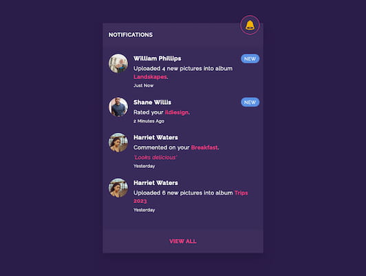
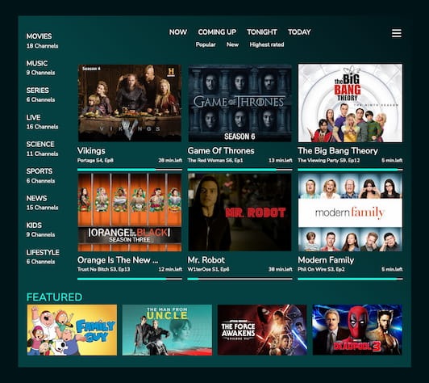
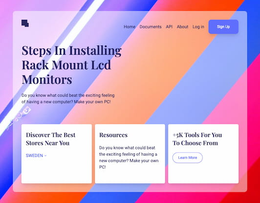
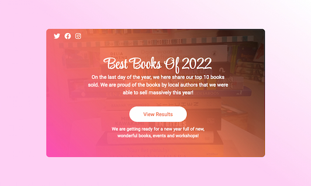
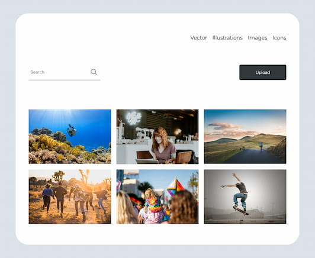

# I Code This - Daily Challenges

This is a growing collection of challenges solved for the platform [I Code This](https://iCodeThis.com/?ref=Katrien). I Code This posts daily web development challenges.

## Table of contents

- [Intro](#intro)
- [Challenges](#challenges)
  - [Challenge 55](#challenge-55)
  - [Challenge 54](#challenge-54)
  - [Challenge 53](#challenge-53)
  - [Challenge 52](#challenge-52)
  - [Challenge 51](#challenge-51)
  - [Challenge 50](#challenge-50)
  - [Challenge 49](#challenge-49)
  - [Challenge 48](#challenge-48)
  - [Challenge 01](#challenge-01)
- [Author](#author)

## Intro

All the solutions are deployed on Github using Github Pages. You'll find the links here in ascending order (latest exercise on top).
Unless noted otherwise, the building of the exercises is done with:

- Semantic HTML5 markup
- CSS custom properties
- Flexbox
- CSS Grid
- Mobile-first workflow
- Vanilla JS

## Challenges

### Challenge 56

- [Code URL](https://github.com/graficdoctor/i-code-this-daily-challenges/tree/main/056-app-notifications)
- [Live URL](https://graficdoctor.github.io/i-code-this-daily-challenges/056-app-notifications)

---

### Challenge 55

- [Code URL](https://github.com/graficdoctor/i-code-this-daily-challenges/tree/main/055-upsell-features)
- [Live URL](https://graficdoctor.github.io/i-code-this-daily-challenges/055-upsell-features)

**Useful Resources**

- [Border Gradient Button](https://codesandbox.io/s/border-gradient-button-with-border-radius-50oi4?file=/index.html:413-538)

---

### Challenge 54

- [Code URL](https://github.com/graficdoctor/i-code-this-daily-challenges/tree/main/054-tv-app)
- [Live URL](https://graficdoctor.github.io/i-code-this-daily-challenges/054-tv-app)

---

### Challenge 53

- [Code URL](https://github.com/graficdoctor/i-code-this-daily-challenges/tree/main/053-glassy-landing)
- [Live URL](https://graficdoctor.github.io/i-code-this-daily-challenges/053-glassy-landing)

---

### Challenge 52

- [Code URL](https://github.com/graficdoctor/i-code-this-daily-challenges/tree/main/052-promo-card)
- [Live URL](https://graficdoctor.github.io/i-code-this-daily-challenges/052-promo-card)

---

### Challenge 51

- [Code URL](https://github.com/graficdoctor/i-code-this-daily-challenges/tree/main/051-accordion)
- [Live URL](https://graficdoctor.github.io/i-code-this-daily-challenges/051-accordion)

**Useful Resources**

- [Accordion Lesson by John Smilga](https://www.vanillajavascriptprojects.com/)

---

### Challenge 50

- [Code URL](https://github.com/graficdoctor/i-code-this-daily-challenges/tree/main/050-subscribe-pop-up)
- [Live URL](https://graficdoctor.github.io/i-code-this-daily-challenges/050-subscribe-pop-up)

**Useful Resources**

- [Pure CSS Custom Checkbox Style](https://moderncss.dev/pure-css-custom-checkbox-style/)

---

### Challenge 49

- [Code URL](https://github.com/graficdoctor/i-code-this-daily-challenges/tree/main/049-glass-profile-card)
- [Live URL](https://graficdoctor.github.io/i-code-this-daily-challenges/049-glass-profile-card)

**Useful Resources**

- [Glassmorphism Credit Card](https://codepen.io/ronkeee/pen/KKgJmmz) - Example of Glassmorphism Credit Card
- [backdrop-filter](https://developer.mozilla.org/en-US/docs/Web/CSS/backdrop-filter) - `backdrop-filter`

---

### Challenge 48

- [Code URL](https://github.com/graficdoctor/i-code-this-daily-challenges/tree/main/048-member-subscriptions)
- [Live URL](https://graficdoctor.github.io/i-code-this-daily-challenges/048-member-subscriptions)

**Useful Resources**

- [Shared by an I Code This User](https://icodethis.com/code/630) - Example of how to build a slider

---

### Challenge 01

- [Code URL](https://github.com/graficdoctor/i-code-this-daily-challenges/tree/main/001-photo-gallery)
- [Live URL](https://graficdoctor.github.io/i-code-this-daily-challenges/001-photo-gallery)

**Useful Resources**

- [How to Show Text Above Image on Hover](https://makitweb.com/html-how-to-show-text-above-image-on-hover/)

---

## Author

- Website - [Katrien S](https://www.katriens.be)
- Twitter - [@graficdoctor](https://www.twitter.com/graficdoctor)
