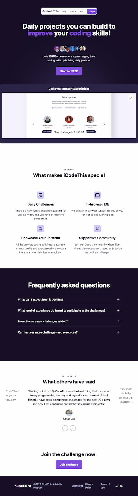

# I Code This - Daily Challenges

This is a growing collection of challenges solved for the platform [I Code This](https://iCodeThis.com/?ref=Katrien). I Code This posts daily web development challenges.

## Table of contents

- [Overview](#overview)
  - [The challenge](#the-challenge)
  - [Screenshot](#screenshot)
  - [Links](#links)
- [My process](#my-process)
  - [Built with](#built-with)
  - [What I learned](#what-i-learned)
  - [Continued development](#continued-development)
  - [Useful resources](#useful-resources)
- [Author](#author)

## Overview

### The challenge

Users should be able to:

- View the optimal layout for each page depending on their device's screen size
- See hover states for all interactive elements throughout the site
- Add JavaScript functionality

### I Code This platform

### Links

All the solutions are deployed here on Github using Github Pages.

- Solution URL: [Github](https://github.com/graficdoctor/i-code-this-daily-challenges)
- Live Site URL: [Github Pages](https://graficdoctor.github.io/i-code-this-daily-challenges/)

## My process

### Built with

- Semantic HTML5 markup
- CSS custom properties
- Flexbox
- CSS Grid
- Mobile-first workflow

### What I learned

Use this section to recap over some of your major learnings while working through this project. Writing these out and providing code samples of areas you want to highlight is a great way to reinforce your own knowledge.

### Continued development

Use this section to outline areas that you want to continue focusing on in future projects. These could be concepts you're still not completely comfortable with or techniques you found useful that you want to refine and perfect.

### Useful resources

- [Example resource 1](https://www.example.com) - This helped me for XYZ reason. I really liked this pattern and will use it going forward.
- [Example resource 2](https://www.example.com) - This is an amazing article which helped me finally understand XYZ. I'd recommend it to anyone still learning this concept.

## Author

- Website - [Katrien S](https://www.katriens.be)
- Twitter - [@graficdoctor](https://www.twitter.com/graficdoctor)
